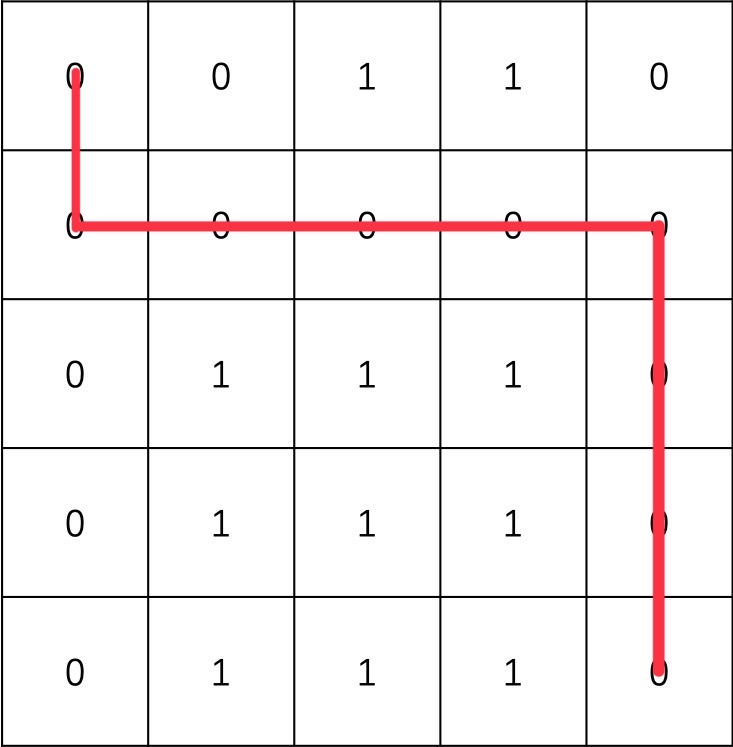

# P0330: 逃出迷宫

## 总时间限制：1000ms  内存限制：65536kB

## 描述

"Boom!" 小锅一觉醒来发现自己落入了一个 N*N (2 <= N <= 20) 的迷宫之中，为了逃出这座迷宫，小锅需要从左上角 (0, 0) 处的入口跑到右下角 (N-1, N-1) 处的出口逃出迷宫。由于小锅每一步都想缩短和出口之间的距离，所以<span style="color:red; font-weight:bold; text-decoration:underline;">他只会往右和往下走</span>。假设我们知道迷宫的地图（以0代表通路，以1代表障碍），请编写一个程序，判断小锅能否从入口跑到出口？

例如，对于下图所示的迷宫：


小锅可以如下图红线所示从迷宫左上角的入口抵达迷宫右下角的出口：\



# 逃出迷宫问题描述

## 输入

第一行为一个整数N，代表迷宫的大小  
接下来N行为迷宫地图，迷宫地块之间以空格分隔  
输入保证(0, 0)和(N - 1, N - 1)处可以通行

## 输出

一行字符串，如果能跑到出口则输出`Yes`，否则输出`No`

## 样例输入


```
5
0 0 1 1 0
0 0 0 0 0
0 1 1 1 0
0 1 1 1 0
0 1 1 1 0
```

## 样例输出

```
Yes
```

## 提示

用递归解。设计函数`ok(r,c)`，返回`True`或`False`，表示从位置`(r,c)`出发能否走到终点。

从`(r,c)` 出发可以想办法往前走一步，然后看问题变成什么

题目说了只能走到0的格子，不能走到1的格子