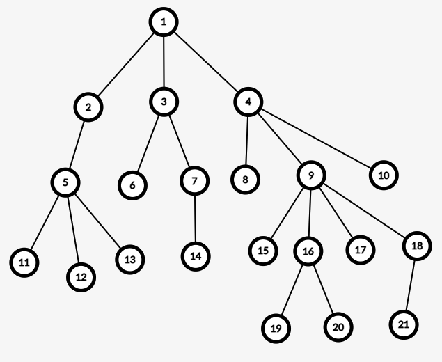

# 250507:简单的树上最近公共祖先查询

总时间限制: 10000ms 单个测试点时间限制: 1000ms 内存限制: 262144kB

## 描述

给出一棵包含 N 个节点的有根树，节点编号 1 到 N，根节点为 R。请回答 Q 个查询，计算节点 u 和节点 v 的最近公共祖先。

祖先定义：任意节点 u 到根节点 R 的路径上的所有点（包括 u 和 R 在内）称为节点 u 的祖先。

最近公共祖先定义：节点 u 和节点 v 的公共祖先中，深度最深的那个节点被称为节点 u 和 v 的最近公共祖先（也可以直观理解为距离它们最近的公共祖先）。

例如，下图是以 1 号节点为根的有根树，其中 11 和 13 的最近公共祖先为 5，2 和 8 的最近公共祖先为 1，19 和 21 的最近公共祖先为 9，16 和 1 的最近公共祖先为 1，15 和 15 的最近公共祖先为 15。

## 输入

第一行包含两个整数 N, R (1<=R<=N<=1000) 分别表示节点总数和根结点编号。
接下来 N-1 行，每行表示一条边，包含两个整数 u, v (1<=u,v<=N, u≠v)。输入保证全部节点构成一棵树。
接下来一行，包含一个整数 Q (1<=Q<=2000) 表示询问次数。
接下来 Q 行，每行两个整数 x, y (1<=x,y<=N) 表示询问节点 x 和 节点 y 的最近公共祖先。

## 输出

一共 Q 行，每行一个整数表示答案。

## 样例输入

21 1
1 2
1 3
1 4
2 5
3 6
3 7
8 4
9 4
10 4
11 5
12 5
13 5
14 7
9 15
16 9
17 9
9 18
16 19
16 20
18 21
10
19 20
19 18
16 10
12 21
11 6
2 5
3 9
14 6
17 1
15 15

## 样例输出
16
9
4
1
1
2
1
3
1
15
