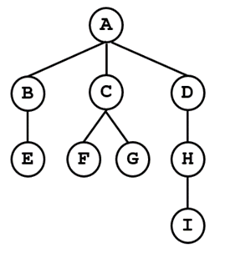

P0740:括号嵌套树  

总时间限制: 1000ms 内存限制: 65536kB  
描述  
可以用括号嵌套的方式来表示一棵树。表示方法如下：  

1) 如果一棵树只有一个结点，则该树就用一个大写字母表示，代表其根结点。  

2) 如果一棵树有子树，则用“树根(子树1,子树2,...,子树n)”的形式表示。树根是一个大写字母,子树之间用逗号隔开，没有空格。子树都是用括号嵌套法表示的树。  

给出一棵不超过26个结点的树的括号嵌套表示形式，请输出其前序遍历序列和后序遍历序列。  

输入样例代表的树如下图：  

输入  
一行，一棵树的括号嵌套表示形式  
输出  
两行。第一行是树的前序遍历序列，第二行是树的后序遍历序列  
样例输入  
####
    A(B(E),C(F,G),D(H(I)))
样例输出
####
    ABECFGDHI
    EBFGCIHDA