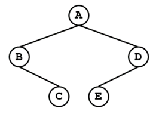

## P0680:括号嵌套二叉树  

总时间限制: 1000ms 内存限制: 65536kB  
### 描述  
可以用括号嵌套的方式来表示一棵二叉树。方法如下：  

'\*'表示空的二叉树  
如果一棵二叉树只有一个结点，则该树就用一个非'*'字符表示，代表其根结点。  
如果一棵二叉左右子树都非空，则用“树根(左子树,右子树)”的形式表示。树根是一个非'*'字符,左右子树之间用逗号隔开，没有空格。左右子树都用括号嵌套法表示。如果左子树非空而右子树为空，则用“树根(左子树)”形式表示；如果左子树为空而右子树非空，则用“树根(*,右子树)”形式表示。  
给出一棵树的括号嵌套表示形式，请输出其前序遍历序列、中序遍历序列、后序遍历序列。  例如，"A(B(*,C),D(E))"表示的二叉树如图所示

### 输入  
第一行是整数n表示有n棵二叉树(n<100)  
接下来有n行，每行是1棵二叉树的括号嵌套表示形式  
### 输出  
对每棵二叉树，输出其前序遍历序列和中序遍历序列  

### 样例输入  

    2
    A
    A(B(*,C),D(E))

### 样例输出  

    A
    A
    ABCDE
    BCAED