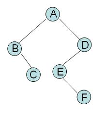

# 25TF2:文本二叉树

## 总时间限制：1000ms 内存限制：65536kB

## 描述

如上图，一棵每个节点都是一个字母，且字母互不相同的二叉树，可以用以下若干行文本表示：

)
在这若干行文本中：

1. 每个字母代表一个节点。该字母在文本中是第几行，就称该节点的行号是几。根在第1行
2. 每个字母左边的'-'字符的个数代表该结点在树中的层次（树根位于第0层）
3. 若某第 i 层的非根节点在文本中位于第n行，则其父节点必然是第 i-1 层的节点中，行号小于n,且行号与n的差最小的那个
4. 若某文本中位于第n行的节点(层次是i) 有两个子节点，则第n+1行就是其左子节点，右子节点是n+1行以下第一个层次为i+1的节点
5. 若某第 i 层的节点在文本中位于第n行，且其没有左子节点而有右子节点，那么它的下一行就是 i+1个'-' 字符再加上一个 '*'

给出一棵树的文本表示法，要求输出该数的前序、后序、中序遍历结果

## 输入

第一行是树的数目 n

接下来是n棵树，每棵树以'0'结尾。'0'不是树的一部分
每棵树不超过100个节点

## 输出

对每棵树，分三行先后输出其前序、后序、中序遍历结果
两棵树之间以空行分隔

## 样例输入
2  
A  
-B  
--*  
--C  
-D  
--E  
---*  
---F  
0  
A  
-B  
-C  
0
## 样例输出
ABCDEF  
CBFEDA  
BCAEFD    

ABC  
BCA  
BAC  