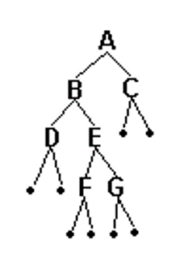

P0700:扩展二叉树  
总时间限制: 1000ms 内存限制: 65536kB  
描述  
由于先序、中序和后序序列中的任一个都不能唯一确定一棵二叉树，所以对二叉树做如下处理，将二叉树的空结点用·补齐，我们把这样处理后的二叉树称为原二叉树的扩展二叉树，扩展二叉树的先序和后序序列能唯一确定其二叉树。 现给出扩展二叉树的先序序列，要求输出其中序和后序序列。  

输入  
扩展二叉树的先序序列（全部都由大写字母或者.组成）  
输出  
第一行：中序序列  
第二行：后序序列  
样例输入  
####
    ABD..EF..G..C..  
样例输出  
####
    DBFEGAC  
    DFGEBCA  